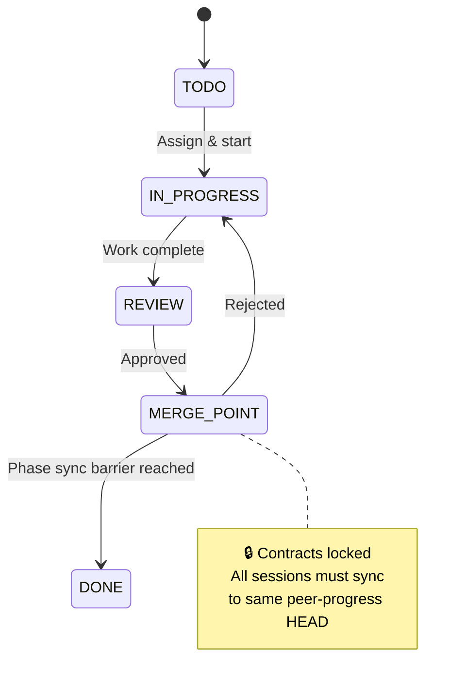
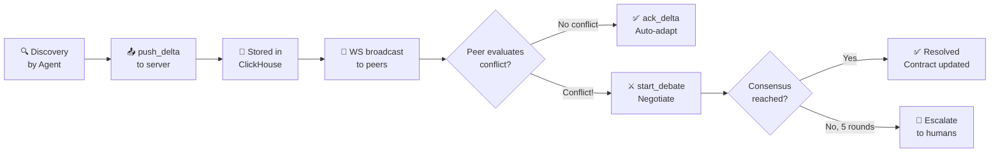

<div align="center">

# 🤝 PeerCode

**Distributed LLM Context Consensus for Parallel Development**

*A coordination server that enables multiple Claude Code sessions to build software in parallel — with live context sync, structured debates, file locking, and AI-powered planning.*

[](https://nodejs.org/)
[](https://www.typescriptlang.org/)
[](https://expressjs.com/)
[](https://vitest.dev/)
[](.)
[](https://clickhouse.com/)
[](https://www.datadoghq.com/)

</div>

---

## 📖 Table of Contents

- [🤝 PeerCode](#-peercode)
  - [📖 Table of Contents](#-table-of-contents)
  - [🎯 The Problem](#-the-problem)
  - [✨ Key Features](#-key-features)
  - [🏗️ Architecture](#️-architecture)
  - [🔄 How It Works](#-how-it-works)
  - [🛠️ Tech Stack](#️-tech-stack)
  - [🚀 Quick Start](#-quick-start)
  - [📡 API Reference](#-api-reference)
  - [🔌 MCP Tools](#-mcp-tools)
  - [💬 WebSocket Events](#-websocket-events)
  - [📁 Project Structure](#-project-structure)
  - [🧪 Testing](#-testing)
  - [🔒 Security](#-security)
  - [⚖️ License](#️-license)

---

## 🎯 The Problem

When teams parallelize work via Claude Code, each developer's local context **drifts** as they discover constraints, change approaches, or uncover dependencies. Today's solutions require humans to manually sync through Slack, PRs, or meetings. The LLMs themselves — the entities actually doing the work — have no mechanism to:

- 🔍 **Detect** when local context contradicts the shared plan
- 📡 **Propagate** significant context changes to peers automatically
- 🔀 **Integrate** peer context updates without human intervention
- ⚔️ **Resolve** contradictions through structured "debate" before humans get involved

**PeerCode fixes this** by treating LLMs as first-class participants in context synchronization.

---

## ✨ Key Features

| Feature | Description |
|---------|-------------|
| 🧠 **AI-Powered Planning** | Claude API decomposes projects into phases, tasks, and interface contracts |
| 📡 **Context Delta Propagation** | Bidirectional live sync of discoveries, contract changes, and scope shifts |
| 🔒 **File-Level Locking** | Granular locks at file, section, or line level with auto-expiry |
| ⚔️ **Structured Debates** | Agents negotiate conflicts over up to 5 rounds before human escalation |
| 🔄 **GitHub Sync Coordination** | Serialized push coordination to the `peer-progress` branch |
| 👁️ **Real-Time Presence** | Track which sessions are online and what they're working on |
| 📊 **Datadog LLM Observability** | Full tracing of every MCP tool call and agent action |
| 💾 **ClickHouse Event Streaming** | Append-only audit trail for deltas, debates, and sync events |

---

## 🏗️ Architecture

```mermaid
graph TB
    subgraph "Client Layer"
        UI["🌐 Web UI<br/>(Roadmap + Kanban)"]
        CA["🤖 Claude Session A<br/>(MCP Client)"]
        CB["🤖 Claude Session B<br/>(MCP Client)"]
        CC["🤖 Claude Session C<br/>(MCP Client)"]
    end

    subgraph "PeerCode Server"
        REST["🔌 REST API<br/>/api"]
        MCP["📡 MCP Server<br/>/mcp"]
        WS["⚡ WebSocket<br/>/ws"]
        BUS["🔄 Event Bus"]

        subgraph "Core Services"
            PS["📋 Project Service"]
            TS["📝 Task Service"]
            LS["🔒 Lock Service"]
            DS["📡 Delta Service"]
            DBS["⚔️ Debate Service"]
            PLN["🧠 Planning Service"]
            SYN["🔄 Sync Service"]
            PRS["👁️ Presence Service"]
        end
    end

    subgraph "Storage Layer"
        CH["💾 ClickHouse<br/>(Event Streams)"]
        MEM["🧠 In-Memory<br/>(Live State Fallback)"]
    end

    subgraph "External Integrations"
        ANTH["🧠 Anthropic API<br/>(Claude)"]
        NIM["🔍 Nimble<br/>(Web Search)"]
        DD["📊 Datadog<br/>(LLM Observability)"]
    end

    UI -->|HTTP| REST
    CA -->|Streamable HTTP| MCP
    CB -->|Streamable HTTP| MCP
    CC -->|Streamable HTTP| MCP
    UI -->|WS| WS
    CA -.->|WS subscribe| WS
    CB -.->|WS subscribe| WS
    CC -.->|WS subscribe| WS

    REST --> BUS
    MCP --> BUS
    BUS --> WS

    PS --> MEM
    TS --> MEM
    LS --> MEM
    DS --> MEM
    DBS --> MEM
    SYN --> MEM
    PLN --> ANTH
    DBS --> NIM

    BUS --> CH
    DS --> CH
    DBS --> CH

    MCP --> DD
```



---

## 🔄 How It Works

### Agent Coordination Loop

```mermaid
sequenceDiagram
    participant A as 🤖 Claude A
    participant S as 🖥️ PeerCode Server
    participant B as 🤖 Claude B

    Note over A,B: 1. Sync Phase — Pull context before work
    A->>S: peercode_get_deltas(projectId)
    S-->>A: { deltas, requiresAction: false }
    A->>S: peercode_lock_file("src/auth.ts", 10-45)
    S-->>A: { lockId, success: true }

    Note over A,B: 2. Work Phase — Push discoveries
    Note over A: Discovers API contract change needed
    A->>S: peercode_push_delta(type: "contract_change", ...)
    S->>B: WS: delta_received 🔔

    Note over A,B: 3. Conflict Phase — Structured debate
    B->>S: peercode_get_deltas()
    S-->>B: { requiresAction: true ⚠️ }
    B->>S: peercode_start_debate(position, constraints)
    S->>A: WS: debate_update 🔔

    loop Debate Rounds (max 5)
        A->>S: peercode_respond_debate(message)
        S->>B: WS: debate_update 🔔
        B->>S: peercode_respond_debate(message)
        S->>A: WS: debate_update 🔔
    end

    Note over A,B: 4. Resolution
    B->>S: peercode_respond_debate(proposeResolution: true)
    S-->>A,B: Debate resolved ✅

    Note over A,B: 5. Sync Phase — Push to git
    A->>S: peercode_sync_github(action: "start")
    S-->>A: { status: "go", pullShas: [...] }
    Note over A: git pull → resolve → git push
    A->>S: peercode_sync_github(action: "complete", commitSha)
    S->>B: WS: sync_complete 🔔

    Note over A,B: 6. Cleanup
    A->>S: peercode_release_lock(lockId)
```

### Merge Point Flow



### Context Delta Lifecycle



---

## 🛠️ Tech Stack

| Layer | Technology | Purpose |
|-------|-----------|---------|
| 🟢 **Runtime** | Node.js ≥ 20 | Server runtime |
| 🔵 **Language** | TypeScript 6.0 (strict) | Type safety |
| 🌐 **HTTP** | Express 5 | REST API framework |
| ⚡ **Realtime** | ws (WebSocket) | Server-push events |
| 📡 **MCP** | @modelcontextprotocol/sdk | Agent tool protocol |
| 🧠 **AI** | @anthropic-ai/sdk | Project planning & decomposition |
| 🔍 **Search** | Nimble API | Web search for debates & planning |
| 💾 **Storage** | ClickHouse Cloud | Append-only event streams |
| 🧠 **Live State** | In-Memory (with CH fallback) | Mutable coordination state |
| 📊 **Observability** | dd-trace + Datadog LLM Obs | End-to-end tracing |
| ✅ **Validation** | Zod 4 | Schema validation |
| 🧪 **Testing** | Vitest | Unit & integration tests |

---

## 🚀 Quick Start

### Prerequisites

- **Node.js** ≥ 20
- **ClickHouse Cloud** instance (or use in-memory fallback)
- **Anthropic API key** (for AI planning)
- **Datadog** (optional, for LLM observability)

### Setup

```bash
# 1. Clone the repository
git clone <repo-url>
cd Datadog26

# 2. Install dependencies
npm install

# 3. Configure environment
cp .env.example .env
# Edit .env with your keys and endpoints

# 4. Start development server
npm run dev
```

The server starts on `http://localhost:3000` with these endpoints:

| Endpoint | Protocol | Purpose |
|----------|----------|---------|
| `/api/*` | REST | Project, task, lock, delta, debate, sync APIs |
| `/mcp` | MCP (Streamable HTTP) | Agent tool calls |
| `/ws?projectId=<id>` | WebSocket | Real-time event subscriptions |
| `/` | Static HTML | Test UI dashboard |
| `/health` | REST | Health check (includes ClickHouse status) |

### Environment Variables

```env
# Server
PORT=3000

# Anthropic (required for planning/decomposition)
ANTHROPIC_API_KEY=sk-ant-...
ANTHROPIC_MODEL=claude-opus-4-7

# ClickHouse Cloud (append-only streams)
CLICKHOUSE_URL=https://<id>.<region>.clickhouse.cloud:8443
CLICKHOUSE_USER=default
CLICKHOUSE_PASSWORD=...
CLICKHOUSE_DATABASE=peercode

# Datadog LLM Observability
DD_LLMOBS_ENABLED=1
DD_LLMOBS_ML_APP=peercode
DD_LLMOBS_AGENTLESS_ENABLED=0
DD_SITE=datadoghq.com

# Nimble (web search for debates/planning)
NIMBLE_API_KEY=...
```

---

## 📡 API Reference

### Projects

| Method | Endpoint | Description |
|--------|----------|-------------|
| `POST` | `/api/projects` | Create a new project |
| `GET` | `/api/projects` | List all projects |
| `GET` | `/api/projects/:id` | Get full project state |
| `PUT` | `/api/projects/:id/decompose` | Trigger AI decomposition into phases/tasks |

### Team

| Method | Endpoint | Description |
|--------|----------|-------------|
| `POST` | `/api/projects/:id/team` | Add a team member |
| `GET` | `/api/projects/:id/team/:memberId/questions` | Get planning questions |
| `POST` | `/api/projects/:id/team/:memberId/answers` | Submit planning answers |

### Tasks

| Method | Endpoint | Description |
|--------|----------|-------------|
| `GET` | `/api/projects/:id/tasks` | List all tasks |
| `PUT` | `/api/projects/:id/tasks/:taskId/assign` | Assign task to member |
| `PUT` | `/api/projects/:id/tasks/:taskId/status` | Update task status |
| `PUT` | `/api/projects/:id/tasks/:taskId/lock` | Acquire file lock |
| `DELETE` | `/api/projects/:id/tasks/:taskId/lock` | Release file lock |

### Context Deltas

| Method | Endpoint | Description |
|--------|----------|-------------|
| `POST` | `/api/mcp/context` | Push a context delta |
| `GET` | `/api/mcp/context/:projectId` | Get pending deltas |
| `POST` | `/api/mcp/context/:projectId/:deltaId/ack` | Acknowledge a delta |

### Debates

| Method | Endpoint | Description |
|--------|----------|-------------|
| `POST` | `/api/mcp/debate` | Start or respond to a debate |
| `GET` | `/api/mcp/debate/:debateId?projectId=` | Get debate status |

### Sync & Presence

| Method | Endpoint | Description |
|--------|----------|-------------|
| `POST` | `/api/projects/:id/sync` | Start or complete a sync |
| `GET` | `/api/projects/:id/conflicts` | List conflicting deltas & active debates |
| `POST` | `/api/projects/:id/conflicts/:conflictId/resolve` | Resolve a conflict |
| `POST` | `/api/projects/:id/presence` | Register session presence |
| `GET` | `/api/projects/:id/presence` | List active sessions |
| `GET` | `/api/projects/:id/events` | Recent event history |

---

## 🔌 MCP Tools

The MCP server exposes these tools for Claude Code sessions via the Streamable HTTP transport at `/mcp`:

| Tool | Purpose |
|------|---------|
| `peercode_get_project` | Get full project state |
| `peercode_lock_file` | Acquire a file/section lock |
| `peercode_release_lock` | Release a held lock |
| `peercode_heartbeat` | Extend a lock's expiry |
| `peercode_push_delta` | Broadcast a context discovery |
| `peercode_get_deltas` | Pull pending context updates |
| `peercode_ack_delta` | Acknowledge a non-conflicting delta |
| `peercode_start_debate` | Initiate a structured debate |
| `peercode_respond_debate` | Respond in an active debate |
| `peercode_get_debate` | Query debate status |
| `peercode_sync_github` | Coordinate push to `peer-progress` |
| `peercode_create_phase` | Dynamically create a new phase |
| `peercode_create_task` | Dynamically create a new task |
| `peercode_update_task` | Update task properties |
| `peercode_move_task` | Move task to a different phase |
| `peercode_replan` | Trigger AI replanning |
| `peercode_web_search` | Nimble web search (debates/planning only) |

---

## 💬 WebSocket Events

Connect to `/ws?projectId=<id>` to receive real-time events:

```typescript
// Context delta received
{ event: "delta_received", projectId, delta: ContextDelta }

// Lock acquired or released
{ event: "lock_changed", projectId, file, lockedBy?, released? }

// Debate started or updated
{ event: "debate_update", projectId, debate: Debate }

// GitHub sync completed
{ event: "sync_complete", projectId, commitSha, files }

// Task status changed
{ event: "task_update", projectId, taskId, status, assignee }

// Phase created / task created / task moved / replanned
{ event: "task_update", projectId, type, ... }
```

---

## 📁 Project Structure

```
peercode-server/
├── 📄 src/
│   ├── 📄 index.ts                  # Entry point — wires all transports
│   ├── 📄 config.ts                 # Environment config (Zod-validated)
│   ├── 📂 domain/
│   │   └── 📄 types.ts              # All domain types (Project, Task, Debate, etc.)
│   ├── 📂 services/
│   │   ├── 📄 container.ts          # Composition root — DI for all services
│   │   ├── 📄 eventBus.ts           # Pub/sub for domain events
│   │   ├── 📄 projectService.ts     # Project CRUD + team management
│   │   ├── 📄 taskService.ts        # Task status + assignment
│   │   ├── 📄 lockService.ts        # File lock acquire/release/heartbeat
│   │   ├── 📄 deltaService.ts       # Context delta push/get/ack
│   │   ├── 📄 debateService.ts      # Structured debate rounds
│   │   ├── 📄 planningService.ts    # AI decomposition via Anthropic
│   │   ├── 📄 syncCoordinationService.ts  # Serialized push coordination
│   │   ├── 📄 presenceService.ts    # Session tracking
│   │   ├── 📄 sweeper.ts            # Auto-expire stale locks/debates
│   │   └── 📄 errors.ts             # Domain error types
│   ├── 📂 transports/
│   │   ├── 📂 rest/
│   │   │   └── 📄 router.ts         # Express REST router
│   │   ├── 📂 mcp/
│   │   │   └── 📄 server.ts         # MCP server + Streamable HTTP transport
│   │   └── 📂 ws/
│   │       └── 📄 server.ts         # WebSocket server (per-project subs)
│   ├── 📂 storage/
│   │   ├── 📄 liveStore.ts          # Mutable state interface
│   │   ├── 📄 streamStore.ts        # Append-only event stream interface
│   │   ├── 📄 inMemoryLiveStore.ts  # In-memory LiveStore
│   │   ├── 📄 clickhouseLiveStore.ts # ClickHouse-backed LiveStore
│   │   └── 📄 clickhouseStreamStore.ts # ClickHouse StreamStore
│   ├── 📂 integrations/
│   │   ├── 📄 anthropicClient.ts    # Anthropic API + Nimble search
│   │   └── 📄 nimbleClient.ts      # Nimble web search client
│   ├── 📂 observability/
│   │   └── 📄 datadog.ts            # Datadog LLM Observability init + tracing
│   └── 📂 util/
│       └── 📄 id.ts                 # ID generation utilities
├── 📂 test/
│   ├── 📄 debate.test.ts            # Debate protocol tests
│   ├── 📄 delta.test.ts             # Context delta tests
│   ├── 📄 lock.test.ts              # File locking tests
│   ├── 📄 sync.test.ts              # Sync coordination tests
│   ├── 📄 integration.test.ts       # End-to-end integration tests
│   └── 📄 mock-server.mjs          # Mock server for testing
├── 📂 public/
│   ├── 📄 index.html                # Test UI dashboard
│   └── 📄 app.js                    # Dashboard client logic
├── 📂 skills/
│   └── 📄 peercode.md               # Claude Code skill definition
├── 📂 docs/
│   ├── 📂 logs/                     # Development logs
│   ├── 📂 memory/                   # Context & decisions
│   └── 📂 superpowers/specs/        # Feature specs
├── 📄 TECH_SPEC.md                  # Full technical specification
├── 📄 CLAUDE.md                     # Claude Code project context
├── 📄 vitest.config.ts              # Test configuration
├── 📄 tsconfig.json                 # TypeScript configuration
└── 📄 package.json                  # Dependencies & scripts
```

---

## 🧪 Testing

```bash
# Run all tests
npm test

# Run specific test file
npx vitest run test/debate.test.ts

# Run mock server
npm run mock
```

Test suites cover:

| Suite | File | Coverage |
|-------|------|----------|
| ⚔️ Debates | `test/debate.test.ts` | Debate rounds, resolution, escalation |
| 📡 Deltas | `test/delta.test.ts` | Push, get, ack, conflict detection |
| 🔒 Locks | `test/lock.test.ts` | Acquire, release, overlap, expiry |
| 🔄 Sync | `test/sync.test.ts` | Token coordination, start/complete |
| 🔗 Integration | `test/integration.test.ts` | End-to-end flows |

---

## 🔒 Security

- **No secrets in code** — all credentials via environment variables
- **GitHub tokens** — each developer's Claude session uses its own local git auth; the server never handles GitHub credentials
- **MCP session isolation** — per-session transports keyed by `mcp-session-id`
- **WebSocket auth** — projectId-scoped subscriptions
- **Lock validation** — session IDs verified on release
- **Input validation** — Zod schemas on all MCP tool inputs

---

## ⚖️ License

Private — All rights reserved.

---

<div align="center">

**Built with ❤️ for the Datadog 2026 Hackathon**

</div>
